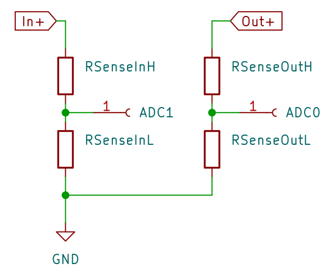

* TOC
{:toc}

# Introduction
In our previous project, we successfully built a [simple boost converter](../010_FirstConverter/FirstConverter.html) and manually set the frequency and duty cycle of the PWM signal. Any change to the input voltage, load or target voltage requires manual adjustment of the duty cycle. Of course, we would like the microcontroller to do these adjustments automatically. This part of the converter is called the control loop. Building control loops is a complex topic, but we'll start with a simple algorithm.

# The Algorithm
Our algorithm is based on a feedback control loop. The microcontroller measures the output voltage using an ADC and compares it with the desired target voltage. If the output voltage is below the target, we slightly increase the duty cycle. If it is above the target, we reduce the duty cycle. This process is repeated at a predefined control loop frequency. To prevent overloading and damaging the components, we also define a maximum duty cycle.

# Measuring the Output Voltage
To implement the feedback control loop, we need to measure the output voltage using an ADC. An ADC, or Analog to Digital Converter, is a device built into the microcontroller that converts an analog voltage signal into a digital value.

The ADC used in the STM32F401 microcontroller is a SAR ADC. It has it's own clock frequency and works by first charging a capacitor to the input voltage (the acquisition or sample phase) and then measuring that voltage (conversion phase). As the switching introduces some noise, it is important to do the measurement at a time when no switching occurs. In our first controllers the end of the acquisition phase is be placed just before switching off the transistor. Details of the timing can be found in the datasheet.

The voltage the ADC accepts is limited by the analog reference voltage. Some modules have a dedicated analog reference voltage pin, others just tie the reference voltage to the supply voltage, which is 3.3V in our case. Typically, the analog reference voltage cannot exceed the supply voltage. The output voltage of the boost converter typically far exceeds those 3.3V, thus we have to scale the voltage down using a voltage divider. The voltage divider consists of two resistors connected in series. The output voltage is taken from the node between the two resistors, and this voltage is proportional to the output voltage of the converter.

The resulting voltage only depends on the ratio of the two resistors, so two very large or two very small resistors produce the same output voltage. If the resistors are small, a large current flows though them and they convert a lot of power to heat. If we choose large resistors, we solve the power issue, but might introduce another one: the ADC has to charge the capacitor during the sample phase. If the resistors are too large, this will affect our measurement, as sample phase ends before the capacitor is fully charged. 

The tool below allows you to calculate and check the ADC setup, include the values for the voltage divider. The ADC frequency is configured in STM32CubeMX. Refer to the ADC configuration and to the clock configuration. In our case it's 21 MHz. The ADC capacitance and sampling switch resistance can be found in the datasheet, and is 7 pF respectively 7 kOhm for the STM32F401. The sampling time can be set to the following values [ADC cycles]: 3, 15, 28, 56, 84, 112, 144, 480.

