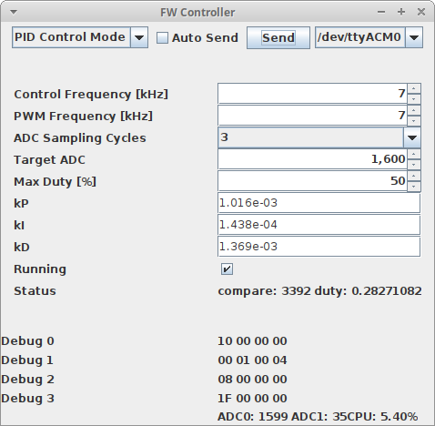

* TOC
{:toc}

# Introduction
In  [Simple Control](../020_SimpleControl/SimpleControl.md) we added a control loop and saw the limitations of the simple duty adjustment control scheme. Now we will use a more advanced and widely used control technique, called the PID control.

In PID control we have a target value and a actual value. In our case, we define a target ADC value and measure the current voltage using the ADC. Then an error is calculated as `error=targetValue-actualValue`.

Next the control loop needs some state: the last error is set to the current error at the end of each loop iteration and used to calculate the change (or differential) of the error. Then there is an integral, which is just the sum of all errors seen so far. In each iteration, the error is simply added to this. 

Finally, to calculate the duty cycle the error, the integral and the differential (`error-lastError`) are summed up weighed by the three parameters `kP`, `kI` and `kD`:

    duty = kP*error + kI*integral + kD*differential

One final detail: if for some reason the target value cannot be reached for some period of time, the error remains non-zero and the integral will grow without limit. Therefore the integral is limited to +/- $$1/\text{kI}$$. This ensures that the integral part of the sum can never exceed `1` and the value of the integral does not grow indefinitely.

For more details see [Wikipedia](https://en.wikipedia.org/wiki/PID_controller)

# Determining the Parameters using Simulation
To use PID control the three parameters `kP`, `kI` and `kD` have to be determined. This is traditionally done by first simulating (in SPICE) or mathematically modelling the gain and phase shift (bode plot) of the power stage. Using this information it is possible to analytically determine the three parameters.

We use an alternative approach: we model the whole system in the time domain and optimize the parameters numerically. This this method is conceptually quite simple and places little restrictions on the modelled behavior.

You find the simulator in the `simulator` subdirectory of this repository. As with all the software in this project, it is not intended to be a a finished product, but to be a starting point for your own experiments. The following paragraphs should help you get started.

The simulator is not an electronic circuit simulator, such as SPICE. To find the parameters the electronic model does not have to be very detailed. The core of the simulator is the `Circuit`, containing multiple `CircuitElement`s. The elements exchange information using `SimulationValue`s. For each step of the simulation, the `Simulator` first asks all elements for the desired next step duration. The shortest step duration reported by any element is chosen for the next step duration. Then all elements are asked to perform a time step of the determined length. In this process, new values are written into the `SimulationValue`s. But reading still yields the value at the beginning of the step. This ensures that the order of element evaluation does not matter. When all elements have completed their step, the new values are applied to the `SimulationValue`s and the process repeats. 

The two most important elements are the power stage and the controller. The power stage reads the input voltage, output current and the switch state, calculates the changes in inductor current and capacitor voltage, and reports the new output voltage. The controller reads the output voltage (and possibly other values), simulates the control loop of the microcontroller and flips the switch on or off, according to the internal logic. 

Then there is the `VoltageSource`, supplying a fixed, optionally time dependent voltage to the power circuit. The `Load` reads the output voltage and calculates the load current. 

Finally the `CostCalculator` observes the target and actual value of the controller and calculates a cost. The `Optimizer` reads these costs and changes the controller parameters in order to minimize them.

The whole process is controlled by the `Simulations` class, which creates one or more circuits, each configured to simulate a different operation point. Then parameters of the controller are optimized to minimize the cost calculated during the simulation of each circuit. These simulations are performed each time the application is started. Afterwards graphs showing the results are shown.

The following graph shows the optimization result and simulation of the PID controller on the circuit presented in [Simple Control](../020_SimpleControl/SimpleControl.md):

Putting the values into the firmware controller and manually causing a load jump:

Channel 2 shows the output voltage in DC coupling, while channel 1 shows it with AC coupling, using a higher resolution. The voltage spike of 0.5V is higher than predicted (0.2V), but the settle time of around 5ms matches.

The next picture shows the pwm output on channel 1. We can clearly see the reduction of the duty cycleduring the jump.

And finally a more detailed shot of the waveform (both channels showing the output voltage). I guess the peak after the turn-off of the transistor is due to the internal resistance of the capacitor. I might investigate this further in a later post.

